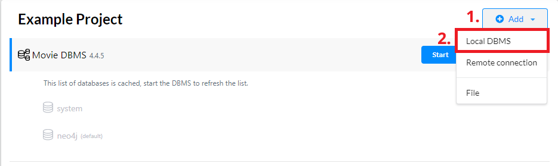
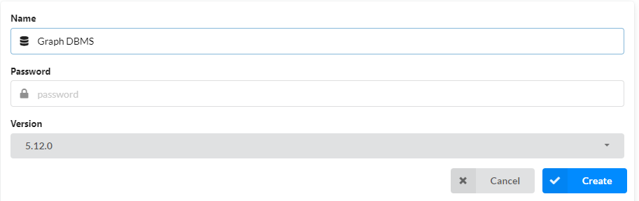
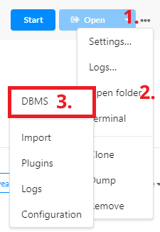
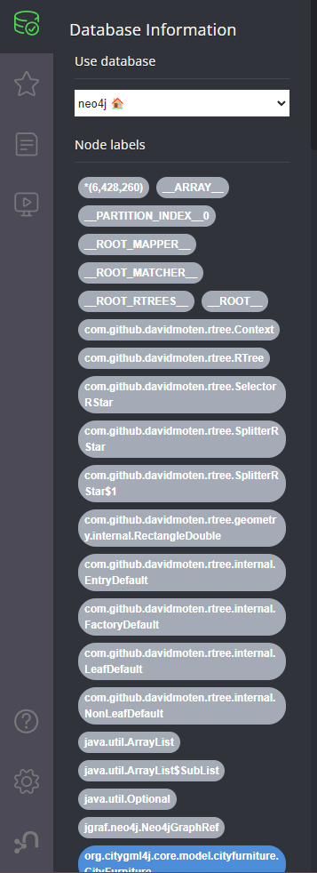
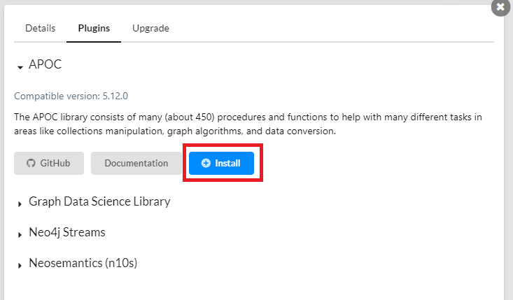
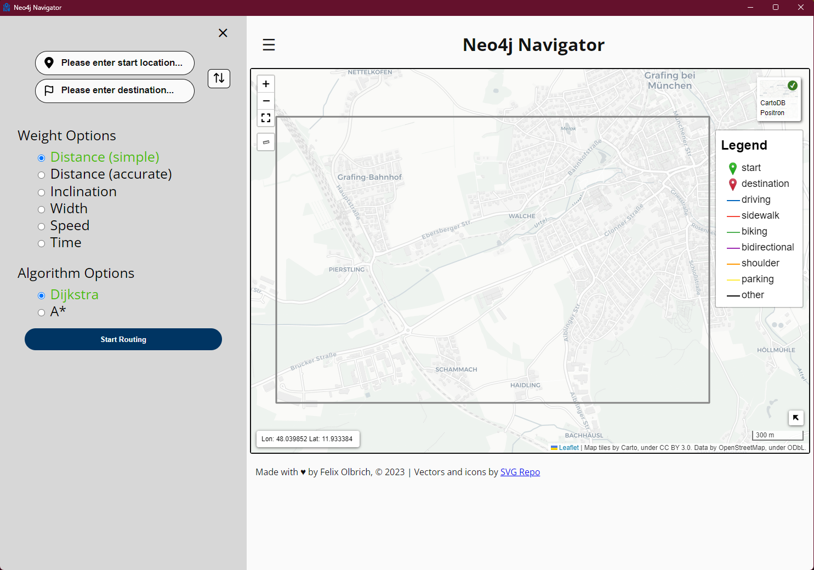
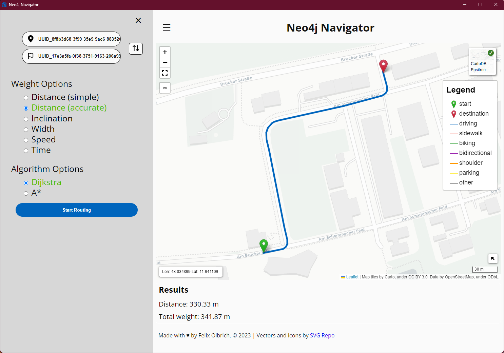
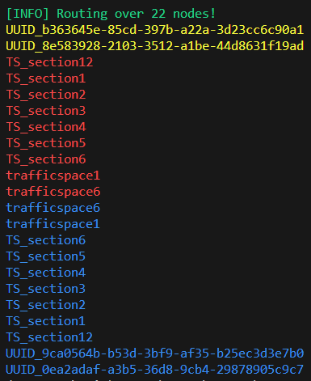

# neo4j_navigator

This is the implementation and testing of the Neo4j Navigator. The project is part of the master's thesis **"Multimodal Navigation Applications for CityGML 3.0 using a Graph Database"** by **Felix Olbrich** at **TUM** (Technical University of Munich).

## Installation

Initial installation of Neo4j Desktop.

1. Create new DMBS
   
   1. Select the latest version of Neo4j.
   2. Store the password. It will be needed later.


**ATTENTION: Do not run the database before adding the files!**
Otherwise, the database will be created with the default setup and you will have to delete it and start over.

2. Open the local DMBS folder via the ... menu

1. Copy the content of the `neo4jDB/data/databases/neo4j` folder into the local DMBS folder `data/databases`
2. Repeat the copy process for the `neo4jDB/data/transactions/neo4j` folder into the local DMBS folder `data/transactions`
3. Run the DMBS
4. If all works, the database should be running and the browser can be opened via the "Open" button in the DMBS
5. Check if the `'neo4j'` database is running and if the data is loaded correctly by running the following query in the browser:

```cypher
MATCH (n) RETURN count(n);
```
Here, the number of nodes is counted. If the result is 0 or the query does not work, the data is not loaded correctly. Repeat the steps above and check if the files are in the correct folders.

OR

```cypher
MATCH (n) RETURN n LIMIT 25;
```

Here, you should get a list of 25 nodes or a graph view of the nodes. If nothing is displayed, the data is not loaded correctly. Repeat the steps above and check if the files are in the correct folders.

Also, check the node and relationship labels in the sidebar of the Neo4j browser! Those should be the similar to the screenshot below.



## Preprocessing steps

### Python preparation

1. Install the Python packages from the [`conda_package_requirements.yaml`](conda_package_requirements.yaml) file.

```bash
conda env create -f conda_package_requirements.yaml
```

2. Activate the environment

```bash
conda activate neo4j_navigator
```

[connection_test.py](connection_test.py) is a script to test if the connection to the Neo4j database works using the Neo4j Python driver. It tries to connect to the database and makes a simple query. The match query should return the total number of nodes if the connection works.

### Database Preparation

1. Install the APOC plugin for Neo4j Desktop via the side menu when selecting the created database.

2. When the database is still running, stop it then select APOC under the Plugins tab and click install.
3. Add the database password to the file **constants.py**. If it does not exist, create it in the same folder as the other Python scripts. An example is given with the [constants-example.py](constants-example.py) file.

```python
username = "neo4j" # default username
password = "YOUR_PASSWORD_HERE" # default password is 'neo4j'
```

4. Run the pre-processing script [main_test_preprocessor.py](main_test_preprocessor.py) to add the necessary labels and properties to the database. **ATTENTION!**
   1. If you want to pre-process the **default** dataset, use the `default_preprocessing()` function.
   2. If you want to pre-process the **garage** dataset, use the `parking_garage_dataset_preprocessing()` function. Using this function, the weight calculation will not be triggered, as the parking garage dataset requires a different approach for the weight calculation.

## Usage of the Neo4j Navigator

### Using the GUI Application

1. To start the application run the GUI interface via the script [UI_eel.py](UI_eel.py).
2. A splash screen will appear while the application is loading. This may take a few seconds.
3. After the application has loaded, the main screen will appear. The application is now ready to use.

   1. Select the start and destination nodes, either using UUIDs from TrafficSpaces, geographical coordinates or by clicking on the map after selecting the input box.
   2. Change the routing mode if necessary.
   3. Change the algorithm if needed.
   4. Start the routing by clicking the "Start Routing" button.
4. Depending on the route length, the visualization may take a few seconds to load. The route will be displayed on the map and the route information will be displayed in the text box below the map.

5. You can change the start and destination nodes and start a new routing by clicking the "Start Routing" button again after the routing has finished.

### Using the Garage Dataset

Use the `parking_garage_routing_test(start_id, end_id)` function as provided in the [main_test_navigator.py](main_test_navigator.py) file. You can manually change the start and destination node IDs in the function call. Default IDs are set which work for the synthetic 'Grafing Garage' dataset. The function will return the shortest path between the two nodes. If the path uses the entrance node of the parking garage, the routing will be split. A random parking spot will be chosen and a second routing will be performed from the entrance node to the parking spot. Then a third routing call connects the parking spot to the destination node.

The result is visualized in the console. In yellow, the route IDs to the garage are listed. In red, the routing IDs inside the garage to the parking spot are listed and in blue the route IDs from the parking spot to the destination node are listed. An example can be seen in the screenshot below.



<!-- Description of another multimodal routing application: https://traveltime.com/blog/multimodal-routing-traveltime-api -->